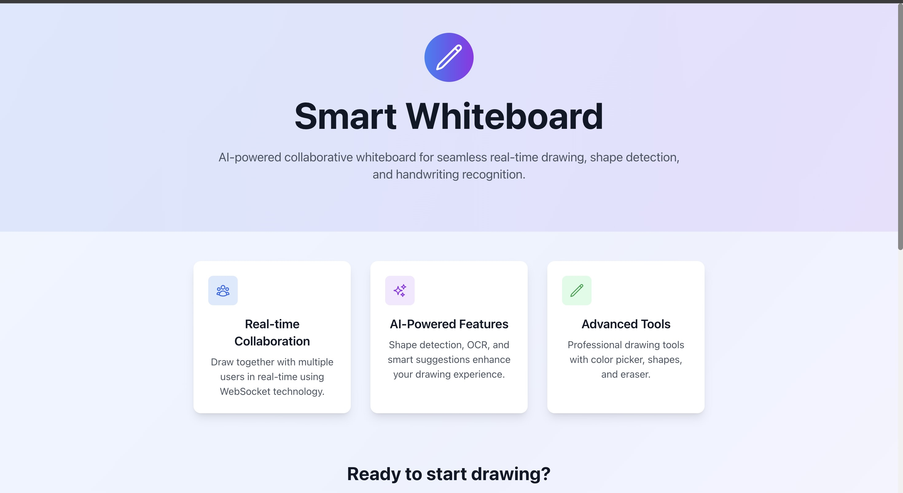
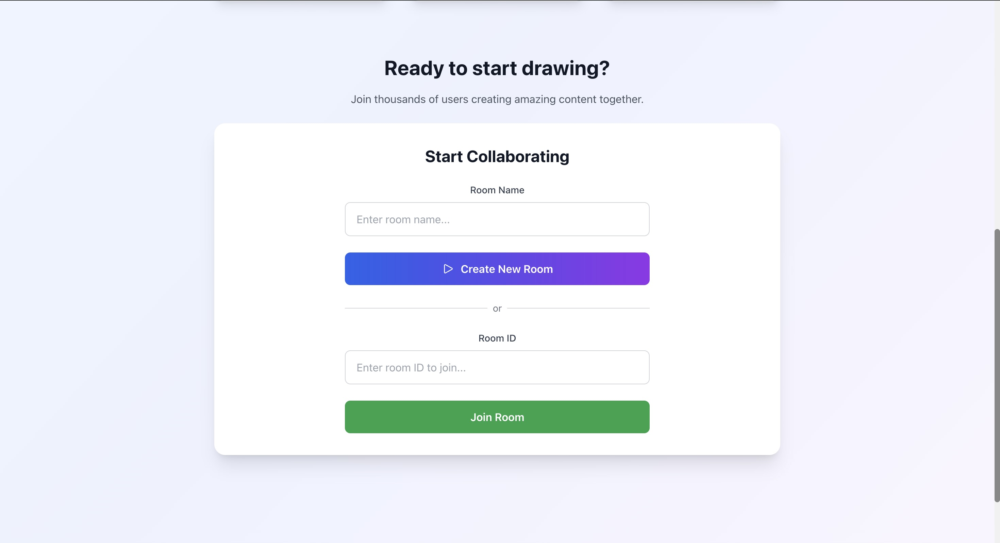
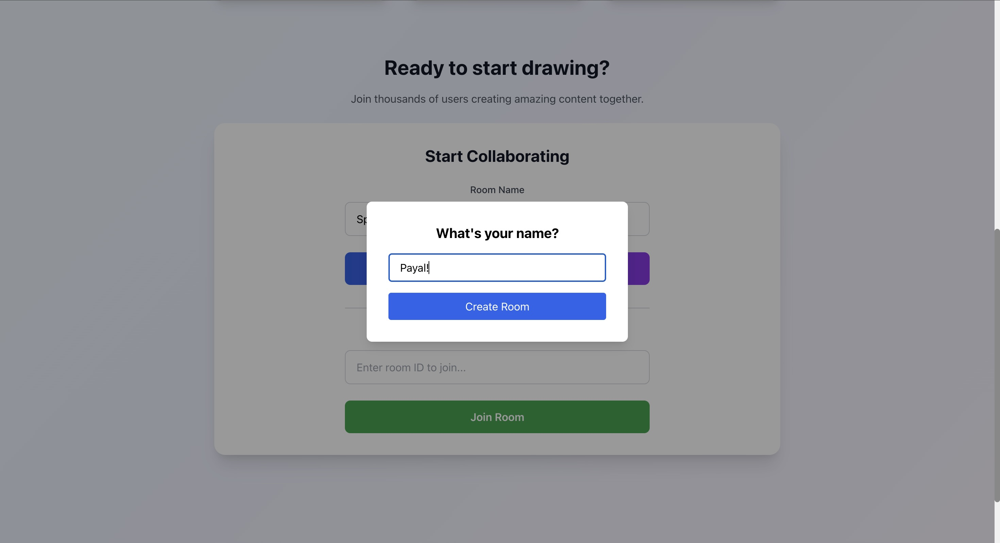
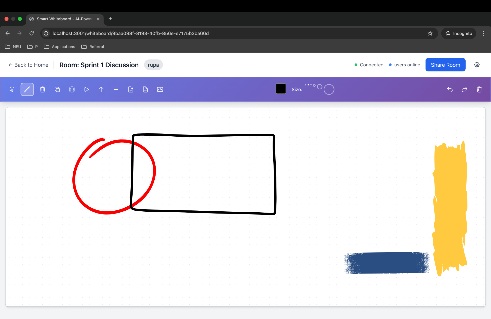
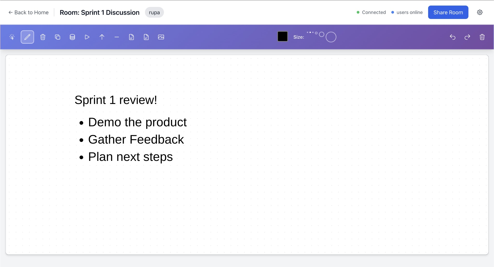
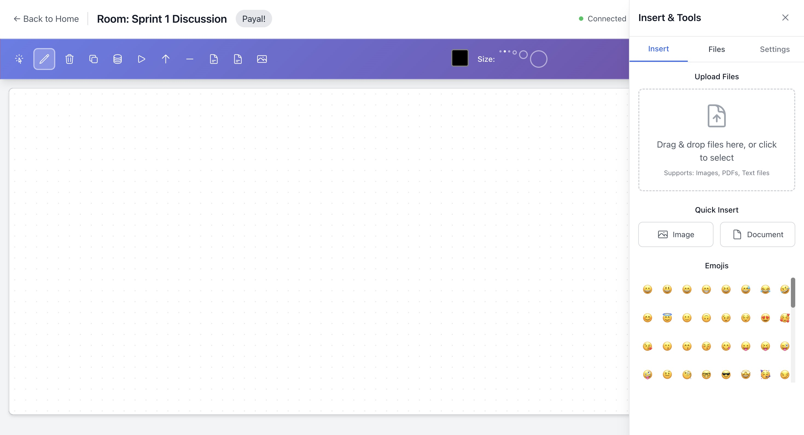

# Smart Whiteboard 

A modern whiteboard app built with React, TypeScript, Fabric.js, and FastAPI. It’s got all the good stuff like drawing tools, shapes, text editing, file uploads. Real-time collaboration is the highlight of the whiteboard so everyone can work together live!






## Features

### Drawing & Painting
- **Freehand Drawing**: Smooth pen tool with customizable colors and brush sizes
- **Shape Tools**: Rectangle, circle, triangle, arrow, and line tools
- **Interactive Shapes**: Resize, rotate, and reposition shapes with handles
- **Color Fill**: Fill shapes with custom colors and transparency
- **Eraser Tool**: Remove drawings and elements




### Text & Notes
- **Text Tool**: Add text anywhere on the canvas with rich formatting
- **Font Options**: Multiple font families, sizes, bold, italic, and colors
- **Real-time Editing**: Click to edit text directly on the canvas



### Insert Menu
- **Image Upload**: Drag & drop or select images from your system
- **File Support**: Upload PDFs, PNG, JPEG as background or elements
- **Emoji Library**: Extensive emoji picker with 100+ emojis



### UI & Controls
- **Floating Toolbar**: Comprehensive tool selection with contextual properties
- **Color Picker**: Advanced color selection with hex values
- **Zoom Controls**: Zoom in/out and pan across the canvas
- **Grid System**: Optional grid overlay with snap-to-grid functionality
- **Responsive Design**: Works on desktop and mobile devices

### Canvas Behavior
- **Multi-select**: Select multiple elements with shift+click
- **Group Operations**: Group and ungroup elements (coming soon)
- **Alignment Guides**: Visual guides for precise positioning
- **Undo/Redo**: History management for all operations
- **Real-time Sync**: Live collaboration with other users

### Architecture
- **Modular Components**: Each tool and feature is isolated and reusable
- **State Management**: Zustand for efficient state management
- **TypeScript**: Full type safety throughout the application
- **Fabric.js Integration**: Professional canvas manipulation library
- **Socket.IO**: Real-time communication and collaboration

## Getting Started

## Usage Guide

### Creating a Room
1. Enter your name when prompted
2. Choose a room name or join an existing room
3. Start collaborating with others in real-time

### Drawing Tools
- **Pen Tool**: Click and drag to draw freehand
- **Shape Tools**: Click and drag to create shapes
- **Text Tool**: Click anywhere to add text
- **Select Tool**: Click elements to select and modify them

### Working with Elements
- **Select**: Click on any element to select it
- **Move**: Drag selected elements to reposition
- **Resize**: Use corner handles to resize elements
- **Rotate**: Use rotation handle to rotate elements
- **Delete**: Press Delete key to remove selected elements

### File Uploads
1. Click the sidebar icon to open the insert panel
2. Drag and drop files or click to browse
3. Supported formats: Images (PNG, JPG, GIF, SVG), PDFs, Text files
4. Files are automatically validated and optimized

### Collaboration
- **Real-time Sync**: All changes sync instantly with other users
- **User Presence**: See who's currently in the room
- **Share Room**: Copy room link to invite others
- **Live Cursors**: See other users' cursors (coming soon)

## Technical Stack

### Frontend
- **React 18**: Modern React with hooks and functional components
- **TypeScript**: Type-safe development
- **Fabric.js**: Professional canvas manipulation
- **Zustand**: Lightweight state management
- **Tailwind CSS**: Utility-first CSS framework
- **Socket.IO Client**: Real-time communication
- **React Dropzone**: File upload handling
- **React Colorful**: Color picker component

### Backend
- **FastAPI**: Modern Python web framework
- **Socket.IO**: Real-time WebSocket communication
- **SQLAlchemy**: Database ORM (if using database)
- **Pydantic**: Data validation and serialization

### Development Tools
- **ESLint**: Code linting
- **Prettier**: Code formatting
- **TypeScript**: Static type checking
- **Hot Reload**: Fast development iteration


### Component Architecture

**Core Components:**
- **WhiteboardCanvas**: Handles all drawing operations, element management, and canvas interactions
- **Toolbar**: Provides tool selection and property controls for the active tool
- **Sidebar**: Manages file uploads, emoji insertion, and additional features
- **NameModal**: User authentication and room access control

**State Management:**
- Zustand store for canvas state, tools, and elements
- Real-time synchronization between users
- Local storage for user preferences

## 📁 Project Structure

```
smart-whiteboard-app/
├── frontend/
│   ├── src/
│   │   ├── components/
│   │   │   ├── WhiteboardCanvas.tsx    # Main canvas component
│   │   │   ├── Toolbar.tsx             # Tool selection and properties
│   │   │   ├── Sidebar.tsx             # Insert and settings panel
│   │   │   ├── NameModal.tsx           # User name input
│   │   │   └── HomePage.tsx            # Landing page
│   │   ├── hooks/
│   │   │   └── useWhiteboardStore.ts   # Zustand state management
│   │   ├── types/
│   │   │   └── index.ts                # TypeScript type definitions
│   │   ├── utils/
│   │   │   ├── canvas.ts               # Canvas utility functions
│   │   │   ├── colors.ts               # Color manipulation
│   │   │   └── fileUtils.ts            # File handling utilities
│   │   └── services/
│   │       ├── api.ts                  # API communication
│   │       └── socket.ts               # Socket.IO client
│   └── package.json
├── backend/
│   ├── app/
│   │   ├── api/
│   │   │   └── routes.py               # API endpoints
│   │   ├── models/
│   │   │   └── drawing.py              # Data models
│   │   ├── services/
│   │   │   ├── canvas_service.py       # Canvas business logic
│   │   │   └── ai_service.py           # AI features
│   │   └── core/
│   │       └── config.py               # Configuration
│   └── main.py                         # FastAPI application
└── README.md
```

## Configuration

### Environment Variables

**Frontend (.env)**
```env
REACT_APP_API_URL=http://localhost:8000
REACT_APP_SOCKET_URL=http://localhost:8000
PORT=3000
```

**Backend (.env)**
```env
DEBUG=True
HOST=0.0.0.0
PORT=8000
CORS_ORIGINS=["http://localhost:3000"]
```

### Canvas Settings
- **Default Size**: 1920x1080 pixels
- **Grid Size**: Configurable (10px, 20px, 50px, 100px)
- **Zoom Range**: 0.1x to 5x
- **Max File Size**: 10MB for images, 50MB for documents

## Deployment

### Frontend Deployment
```bash
cd frontend
npm run build
# Deploy the 'build' folder to your hosting service
```

### Backend Deployment
```bash
cd backend
pip install -r requirements.txt
# Deploy using your preferred method (Docker, Heroku, etc.)
```

## Contributing

1. Fork the repository
2. Create a feature branch (`git checkout -b feature/amazing-feature`)
3. Commit your changes (`git commit -m 'Add amazing feature'`)
4. Push to the branch (`git push origin feature/amazing-feature`)
5. Open a Pull Request


### Prerequisites
- Node.js (v16 or higher)
- Python (v3.8 or higher)
- npm or yarn

### Installation

1. **Clone the repository**
   ```bash
   git clone <repository-url>
   cd smart-whiteboard-app
   ```

2. **Install frontend dependencies**
   ```bash
   cd frontend
   npm install
   ```

3. **Install backend dependencies**
   ```bash
   cd ../backend
   python -m venv venv
   source venv/bin/activate  # On Windows: venv\Scripts\activate
   pip install -r requirements.txt
   ```

4. **Set up environment variables**
   ```bash
   # Frontend (.env)
   REACT_APP_API_URL=http://localhost:8000
   REACT_APP_SOCKET_URL=http://localhost:8000
   
   # Backend (env.example -> .env)
   cp env.example .env
   # Edit .env with your configuration
   ```

5. **Start the development servers**
   ```bash
   # Terminal 1 - Backend
   cd backend
   python main.py
   
   # Terminal 2 - Frontend
   cd frontend
   npm start
   ```

6. **Open your browser**
   Navigate to `http://localhost:3000` to access the application.


**Happy Drawing!**
